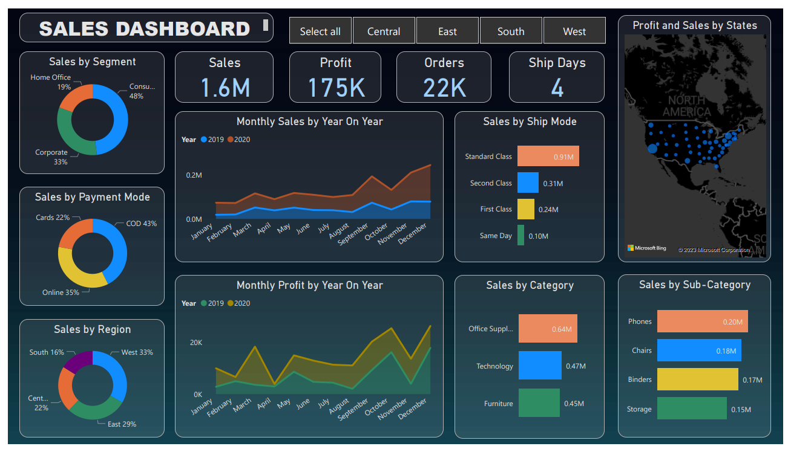
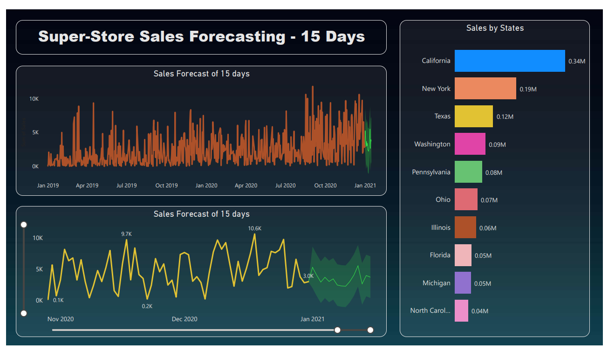

## Project Overview

This project focuses on analyzing SuperStore sales data to uncover key business insights and improve decision-making.

The dashboard provides a comprehensive view of sales performance, profit trends, customer segments, and regional distribution. It also incorporates time-series analysis and sales forecasting to help businesses plan future strategies.

The goal is to transform raw data into meaningful insights that support business growth, operational efficiency, and better customer understanding.

## Tools & Technologies

- Power BI  
- DAX (Data Analysis Expressions)  
- Power Query (Data Cleaning & Transformation)  
- Excel (Data Source)

## Dashboard Preview

### Sales Dashboard

### Sales Forecasting

## Key Insights

- West region generates the highest sales (~33%)
- Consumer segment contributes the largest share (~48%)
- Cash on Delivery (COD) is the most preferred payment mode (~43%)

## 🧮 DAX Measures

Total Sales = SUM(Orders[Sales])

Total Profit = SUM(Orders[Profit])

Sales LY = CALCULATE([Total Sales], SAMEPERIODLASTYEAR('Date Table'[Date]))

## 💡 Business Recommendations

- Focus marketing efforts on the West region to maximize revenue  
- Encourage online payment adoption to reduce COD dependency  
- Increase inventory for high-demand categories like Technology  
- Plan promotional campaigns during Q4 to leverage peak sales season  
- Improve logistics in low-performing regions to boost sales  
- Sales peak during Q4 (October to December)
- Technology category leads in revenue generation
- California is the top-performing state
